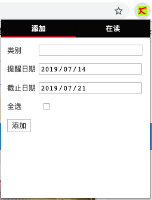
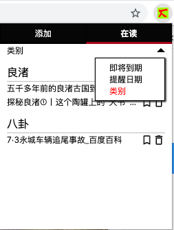
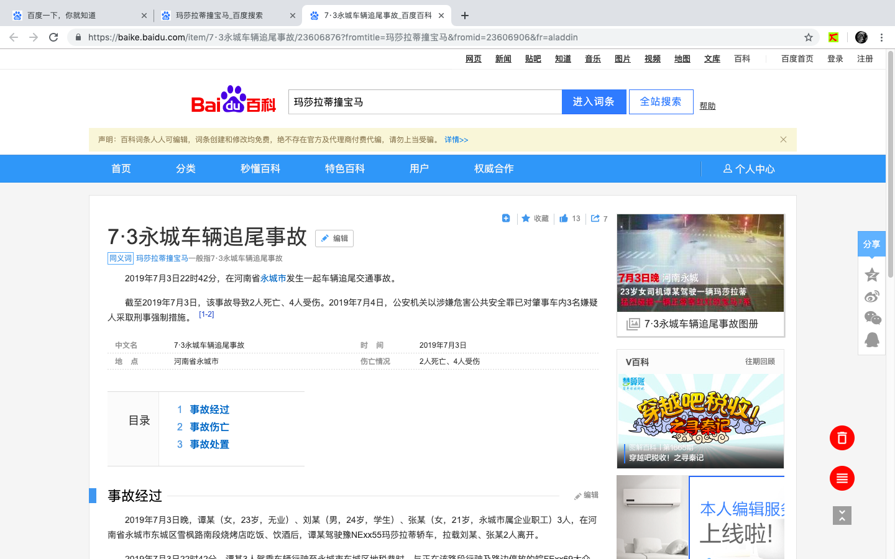

# let-me-read
chrome的阅读辅助插件

在日常生活中，我经常遇到这样的场景：我看到一篇好文章，我觉得它很好，我想读完它，但是并不想现在读，所以我把它加到书签里，然后我就把它忘了😄；或是我为了读完一篇文章，打开了很多参考标签页，但是我没有时间立刻把这些文章都读完，后来我遇到了别的事，打开了别的标签页，为了减轻浏览器的负担，我把一些标签页关掉，于是我就又把那些标签页忘记了😄。为了解决这个问题，我编写了这个插件。虽然起名叫Let Me Read，是个阅读辅助插件，但从功能上讲更像是书签扩展器。

## 功能
插件有两个基本页面『添加』和『在读』。

### 添加
『添加』页面的基本界面如下：

1. 类别 既是添加的页面在『在读』页面的分类依据，也是这个页面在被添加到书签后所在目录的名称。比如类别被设置为article1，在这个页面别添加到书签后，书签所在的目录为 『其他文件夹/let-me-read/article1』。其中第二级目录名可在插件的选项页面进行配置。
2. 提醒日期 如果当前日期大于提醒时间，插件图标的右下方会出现一个badage，告诉你有多少篇文章得赶紧读完。这些文章的目录可在『在读』页面的『即将过期』下看到。提醒日期默认是当前日期的后七天。
3. 截止日期 如果当前日期大于截止日期，响应文章就会别添加到书签中，并从『在读』目录中移除。截止日期默认是当前日期的后14天。
4. 全选 是否将当前窗口的所有页面都加入『在读』。

### 在读
『在读』页面的基本界面如下：

提供了三个分类，『即将到期』、『提醒时间』和『类别』。点击记录的后面的『书签』，将这条记录添加到书签中并从『在读』记录中删除，点击记录后面的『删除』，直接删除这条记录，点击记录的标题，在新标签页中打开这条记录。

可以看到，如果这个页面在插件中存在记录，插件就会在页面的右下方添加三个按钮『删除』、『上次阅读位置』和『显示/隐藏』。点击『删除』，将这个页面从插件中删除；点击『上次阅读位置』，跳转页面到添加页面时阅读的位置。此外，在插件的选项页面，还能配置当页面阅读完毕后，是否自动删除记录。页面阅读完毕的判定通过页面当前位置到页面底部的位置判定，这个阀值也能在插件的选项页面设置。